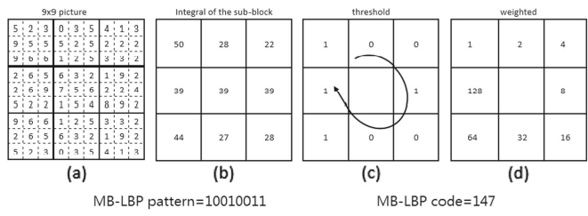

# MBLBP based tracking with Kalman filtering - Prototype

- Writing a python implementation as a prequel to C++.
- Figuring out all engineering challenges before facing C++ challenges as a somewhat-beginner.

environment:

- Docker : ```pytorch/pytorch:2.3.0-cuda12.1-cudnn8-runtime```

Docker run : ```docker run -it -e DISPLAY=$DISPLAY -v /tmp/.X11-unix:/tmp/.X11-unix --network=host --volume=/mnt/d/projects/MBLBP_Kalman_tracking/python_implementation/app:/app --workdir=/app pytorch/pytorch:2.3.0-cuda12.1-cudnn8-runtime /bin/bash```

___
## Algorithm overview

components of a general tracking algorithm :

- **appearance model** : to identify the features that distinguish the target object from other objects
- **Motion Model** : to model the motion of the target object. This essentially allows us to predict the next possible location of the object in a video.
- **Searching Strategy** : An efficient strategy searching for the target in relevant regions of the image  when the object is lost.
  
## Appearance Model : Modified Multi-Scale Block Local Binary Patterns (MB-LBP)

- Instead of all points of the image patch correponding to the target, The MB-LBP features are computed only at a few randomly sampled points of from the relevant image patch.

- A new efficient way of finding feature correspondences is implenented

### Local Binary Patterns (LBPs)-> to MB(multi-block)-LBPS

- The feature encoding of an arbitrary pixel is given by the string formed by thresholding each of the 8 neighbouring pixels (1 is assigneed if $neighbour_i $ > $pixel_{curr}$, else 0).

- The feature encoding of an arbitrary pixel is given by the string formed by thresholding each of the 8 neighbouring pixels.

    
- robust to monotonic greyscale illumnination variation.
- MB-LBP is when this process is done on a 9x9 window considering the sum of each 3x3 window a single pixel.

    
- For a given target object at location $I_t$ and a decriptive image patch $X$ of width $w$, and height $h$ of the object, A set of $k$ (**$k$ is 40 in the paper**) random pixels is selected with uniform probability. A vector of $k$ binary patterns corresponding to each of the randomly selected pixels, is considered as the feature vector for that patch $X$ (and the target object).

### Feature similarity

- The similarit between 2 different binary patterns is the number of corresponding element-wise (XOR $\oplus$ "^" operator) differences, as follows:


$$\mathrm{diff}(\xi_x, \xi_y) \triangleq \sum_{n=0}^{7} \xi_x^{(n)} \oplus \xi_y^{(n)}$$

## Motion Model : Kalman Fiter

Justification : When the objects more somewhat slowly (or the FPS is high enough), the relative motion of pixels between frames can be closely approximated to be linear.

- Kalman Filter is used to implement the motion model because it keeps track of the object's expectation, and variance, which is later used by the searching model.
    1. Step 1 : given an initial ROI (or bounding box), the features of this ROI is computed and used as the initial appearance model.
    2. Step 2 : For all following frames, given the estimated location and variance(uncertainty) of the t'th frame, those of the t+1'th frame are predicted by the Kalman filter.
    3. step 3: Given the predicted location for the t+1'th frame, when $t = t+1$ , The features are extracted from the predicted location, and the "observed" location is the region corresponding to features that match.
    4. step 4: This observed location in $t+1$'th (currently $t$'th)  frame is used to update the Kalman filter, to get the optimal location and uncertainty range.
    5. step 5 : The features then extracted from the optimal location is used to update the appearance model.
    6. next iteration : This process conducted iteratly will track the target object\
**NOTE : During intial computation of the appearance model, The randomly selected $k$ points (pixel locations $(x,y)$ w.r.t the coordinate system of the image patch) are used throughout the lifetime of that object. (each time the patch location is updated, the same $k$ points relative to the new patch location are considered for feature extraction)**

## Searching Model

- The target's object feature vector from the last tracked frame is used as the appearance model for object searching.

## Modelling

given intial target location $l_t = [u_t,v_t]^T$, where $u_t$ and $v_t$ represent vertical and horizontal coordinates at $t$th frame respectively. The target location can be represented as :

$$l_t = l_{t-1} + \Delta l_{t-1}\tau + w_t$$

Where $w_t = [w_{u,t}, w_{v,t}]^T$. $w_{u,t}$ are the approximation errors of veritcal and horizontal coordinates respectively. (assumed to 0 mean gaussian noises with variance $\sigma_w^2$).

The speed of the target is denoted as $\Delta l_t = [du_t/dt, dv_t/dt]$. ($u_t$ and $v_t$) are the velocities along each of the axes, and $\tau$ is the time interval between frames.

The speed of the object in the video will surely change, so we model its error as well:
$$\Delta l_t = \Delta l_{t-1} + dw_t$$

Where $dw_t = [dw_{u,t}/dt, \;dw_{v,t}/dt]^T$. $dw_{u,t}/dt$ and $dw_{u,t}/dt$ are the disturb noises along the vertical and horizontal directions (which are also gaussian with 0 mean and std = $\sigma_{dw}^2$).

Given:
- state vector : $x = [u_t, v_t, du_t/dt, dv_t/dt]^T$ 
- observation of $l_t$ = $z_t$
- The state space model can be formed as: 
$$x_t = Ax_{t-1} + n_t$$
$$z_t = Hx_{t} + m_t$$
where:
- process noise is $n_t = [w_t^T, dw_t^T]^T$ with diagonal covariance $Q = diag \{ \sigma_w^2, \sigma_w^2, \sigma_dw^2, \sigma_dw^2 \} $
- measurement noise is $m_t = [m_{u,t}, m_{v,t}]^T$ represents 0 mean and diagonal covariance matrix $R = diag \{ \sigma_m^2, \sigma_m^2\} $
- $A$ is the state transition matrix : 
$$
\mathbf{A} = \begin{pmatrix}
1 & 0 & \tau & 0 \\
0 & 1 & 0 & \tau \\
0 & 0 & 1 & 0 \\
0 & 0 & 0 & 1
\end{pmatrix},
$$
- $H$ is the measurement matrix
$$
\mathbf{H} = \begin{pmatrix}
1 & 0 & 0 & 0 \\
0 & 1 & 0 & 0
\end{pmatrix}.
$$

Given these establishments, the Prediction and correction can be done as below:

**Prediction** :

$$\hat{\mathbf{x}}_t^- = \mathbf{A} \hat{\mathbf{x}}_{t-1}$$
$$\mathbf{P}_t^- = \mathbf{A} \mathbf{P}_{t-1} \mathbf{A}^T + \mathbf{Q}$$

Where:
- $\hat{\mathbf{x}}_t^-$ is the prediction of $x_t$
- $P_t^-$ is the covariance matrix of $\hat{\mathbf{x}}_t^-$

given the observation $z_t$, correction can be done like so:

**Correction** :

$$\hat{\mathbf{x}}_t = \hat{\mathbf{x}}_t^- + \mathbf{K}_t (\mathbf{z}_t - \mathbf{H} \hat{\mathbf{x}}_t^-)$$
$$\mathbf{P}_t = (\mathbf{I} - \mathbf{K}_t \mathbf{H}) \mathbf{P}_t^-$$
$$\mathbf{K}_t = \mathbf{P}_t^- \mathbf{H}^T (\mathbf{H} \mathbf{P}_t^- \mathbf{H}^T + \mathbf{R})^{-1}$$

where:
- $K_t$ is the Kalman gain matrix
- $P_t$ is the estimated covariance matrix of $\hat{\mathbf{x}}_t$.
