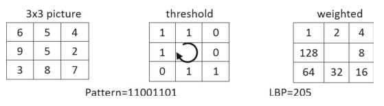
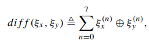

<h2>MBLBP based tracking with Kalman filtering - Prototype</h2>

- Writing a python implementation as a prequel to C++.
- Figuring out all engineering challenges before facing C++ challenges as a somewhat-beginner.

environment:
- Docker : <code>pytorch/pytorch:2.3.0-cuda12.1-cudnn8-runtime</code>

Docker run : <code> docker run -it -e DISPLAY=$DISPLAY -v /tmp/.X11-unix:/tmp/.X11-unix --network=host --volume=/mnt/d/projects/MBLBP_Kalman_tracking/python_implementation/app:/app --workdir=/app pytorch/pytorch:2.3.0-cuda12.1-cudnn8-runtime /bin/bash
</code>

<h2>Algorithm overview</h2>

components of a general tracking algorithm : 
- <b>appearance model</b> : to identify the features that distinguish the target object from other objects
- <b>Motion Model</b> : to model the motion of the target object. This essentially allows us to predict the next possible location of the object in a video.
- <b>Searching Strategy</b> : An efficient strategy searching for the target in relevant regions of the image  when the object is lost.
  
<h2>Appearance Model : Modified Multi-Scale Block Local Binary Patterns (MB-LBP)</h3>
<ul>
    <li> Instead of all points of the image patch correponding to the target, The MB-LBP features are computed only at a few randomly sampled points of from the relevant image patch.</li>
    <li>A new efficient way of finding feature correspondences is implenented</li>
</ul>

<h3> Local Binary Patterns (LBPs)-> to MB(multi-block)-LBPS </h3>
<ul>
    <li>The feature encoding of an arbitrary pixel is given by the string formed by thresholding each of the 8 neighbouring pixels (1 is assigneed if neighbour_i > curr_pixel, else 0). 
    <li>The feature encoding of an arbitrary pixel is given by the string formed by thresholding each of the 8 neighbouring pixels.  
    [1]</li> 
    <li>robust to monotonic greyscale illumnination variation.</li>
    <li>MB-LBP is when this process is done on a 9x9 window considering the sum of each 3x3 window a single pixel.</li>
     
    [1]</li>
    <li>For a given target object at location 'I_t' and a decriptive image patch 'X' of width 'w', and height 'h' of the object, A set of 'k' (<b>k is 40 in the paper</b>) random pixels is selected with uniform probability. A vector of 'k' binary patterns corresponding to each of the randomly selected pixels, is considered as the feature vector for that patch X (and the target object). </li>

</ul>
<h3> Feature similarity </h3>
<ul>
    <li>The similarit between 2 different binary patterns is the number of corresponding element-wise (XOR "^" operator) differences, as follows :  
    [1]
</ul>    

<h2>Motion Model : Kalman Fiter</h2>
<ul>
    <li>Kalman Filter is used to implement the motion model because it keeps track of the object's expectation, and variance, which is later used by the searching model.</li>
    <ul>
        <li>Step 1 : given an initial ROI (or bounding box), the features of this ROI is computed and used as the initial appearance model.</li>
        <li>Step 2 : For all following frames, given the estimated location and variance(uncertainty) of the t'th frame, those of the t+1'th frame are predicted by the Kalman filter.</li>
        <li>step 3: Given the predicted location for the t+1'th frame, when t = t+1, The features are extracted from the predicted location, and the "observed" location is the region corresponding to features that match.</li>
        <li>step 4: This observed location in t+1'th (currently t'th)  frame is used to update the Kalman filter, to get the optimal location and uncertainty range.</li>
        <li>step 5 : The features then extracted from the optimal location is used to update the appearance model.</li>
        <li>next_iter : This process conducted iteratly will track the target object.</li> 
        <li><b>NOTE : During intial computation of the appearance model, The randomly selected k points (pixel locations (x,y) wrt the coordinate system of the image patch) are used throughout the lifetime of that object. (each time the patch location is updated, the same K points relative to the new patch location are considered for feature extraction)</b></li>
</ul>

<h2> Searching Model : </h2>
<ul>
    <li> The target's object feature vector from the last tracked frame is used as the appearance model for object searching. </li>
</ul>

